* Grab [CheatEngine](https://www.cheatengine.org/downloads.php) if you don't already have it.
* In CheatEngine, load the Rekordbox process.

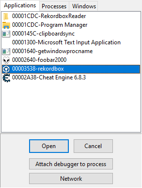

**spoiler:** you'll want to skip straight to [Finding the Deck Struct via bpm](#finding-the-deck-struct-via-bpm) since that JustWorks (it covers artist/title etc)

## Artist/Title Pointers
* In Rekordbox, load a song into the deck you want to find pointers for.
* On the right half of CheatEngine, set the Value Type to String, and enter the exact song title or artist name loaded into the deck.

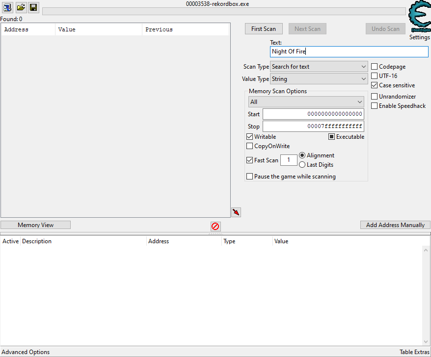

* Set the Value Type to Array of byte, add "00" at the end, and click First Scan. Adding "00" to the end of the array filters a lot of false-positive addresses that might have the file name loaded instead.

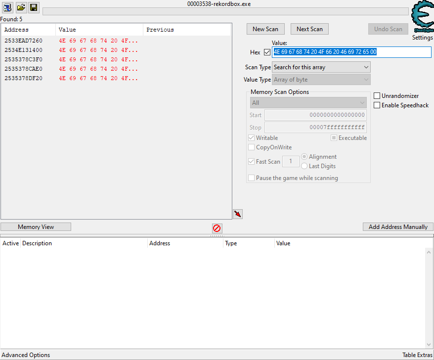

* Add all addresses found to the list at the bottom by double-clicking them.

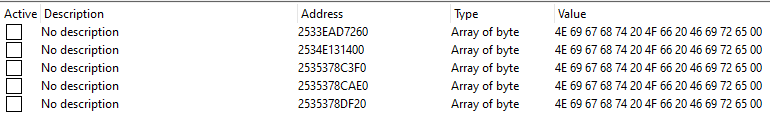

* For each address, right-click and choose "Browser this memory region" and make sure the value is surrounded by mostly garbage data. The first image below is similar to what you want to see. If it looks like the second image below (surrounded by other similar values or file names), it might find a valid pointer but not of the type we are looking for. Remove any bad addresses from the list.

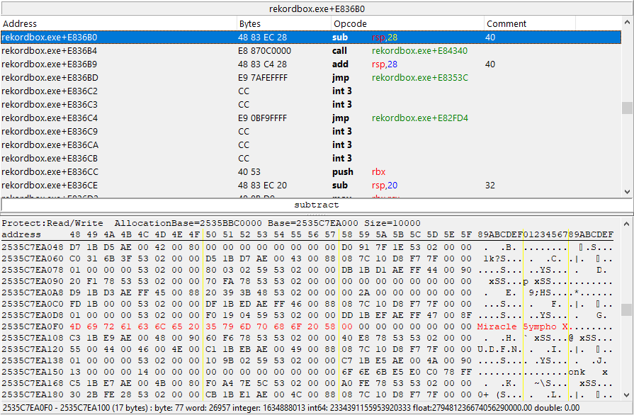
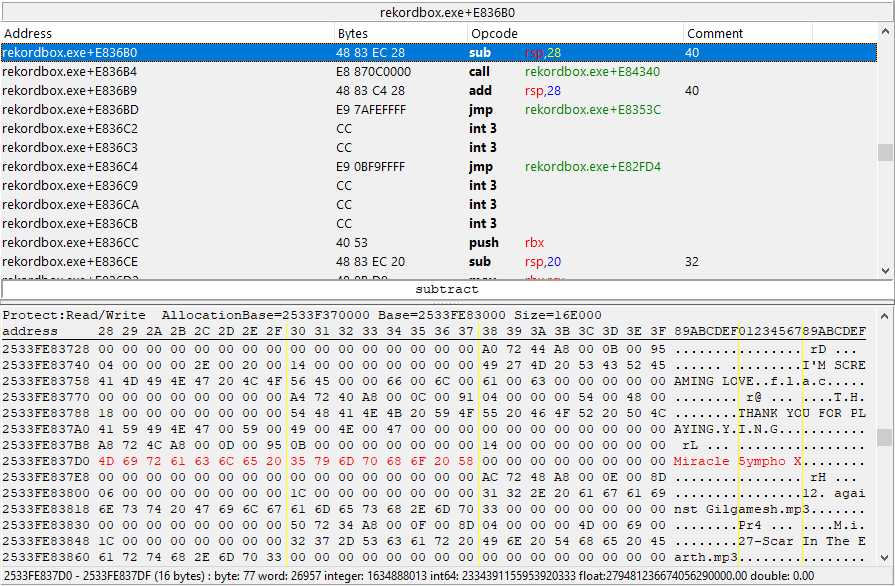

### EZ MODO
1. Choose one address, right-click and select "Pointer scan for this address" and click OK in the window that pops-up. You will have to select a location to save a file it generates, this can be chosen anywhere. 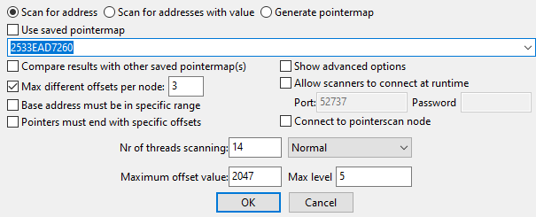
2. Load a new track into the deck. In the pointer scan window, right-click anywhere in the value list and click Resync modulelist. 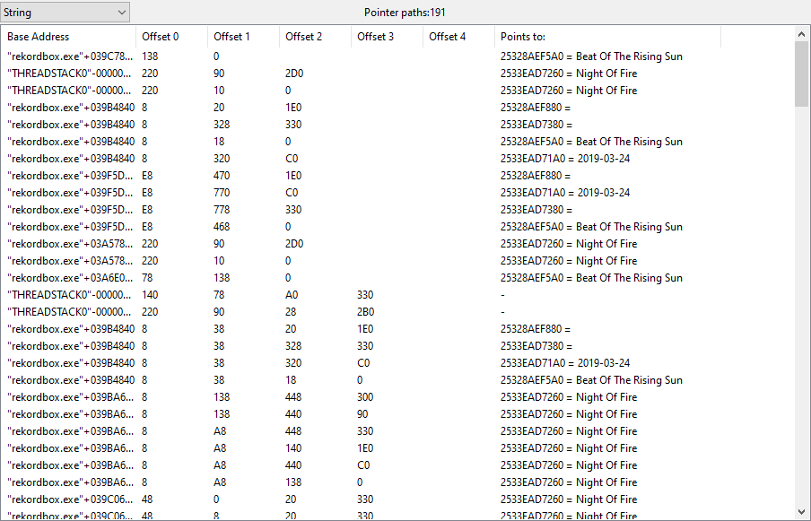
3. Search for the new string you want in the list. You can either confirm if multiple instances point to the same address or not.
4. In the pointer scan window, click "Pointer scanner" at the top and select "Rescan memory." In the window that pops up, enter one of the addresses that has the value you want, and click OK, saving the file when prompted. 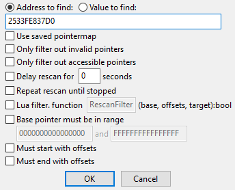
5. You should now have a much shorter list of addresses. Repeat step 2. There is a good chance all the pointers will point to the same new address. You can repeat step 2 as many times as you want to be safe.
6. Once you are comfortable with the list of pointers knowing they properly point to the value you want, you have two options.
  1. The first option is to choose one of the pointers and use it. This pointer is only guaranteed to work with the deck mode you had Rekordbox running in when finding the pointer.
  2. The second option is to change rekordbox's deck mode, Resync the modulelist in the pointer scan window, and repeat step 2 as needed. You will also need to change the deck mode back even if some of the pointers seem to be fine, as they might not actually be fine. This has a high chance of failing in general, and going Hard Mode might be needed to increase your chances of finding a pointer that works regardless of the deck mode being changed.
7. Repeat this step for each deck you want tags for.

### HARD MODE
I may have gotten lucky when I went through these steps to write this, and you might not actually find a pointer that works for all decks.

1. Use deck 1 for this, and search for the title, as we can find a pointer that can be used for all decks.
2. Repeat step 1 from ez mode on each address, keeping all pointer scan windows open.
3. Repeat steps 2-4 of ez mode taking but for all pointer scan windows. Do this until you have a decently small list of possible pointers.
4. Load songs into all 4 decks.
5. Switch between 2-deck and 4-deck mode, refreshing the pointer scan windows after each switch. Do this two or three times. You should be left with only a couple potentially valid pointers.
6. On the main CheatEngine window, click "Add Address Manually." In the window that pops up, check the "Pointer" box, set the Type to Text, and add as many offsets as is needed for whatever pointer you are checking.  
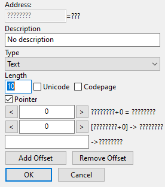
7. Add the base address and offsets, verify the value is what you expect.  
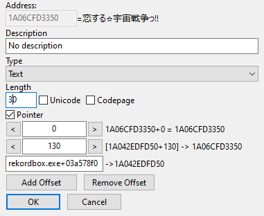
8. Increase the last non-0 offset by 0x8. Verify it shows the artist.  
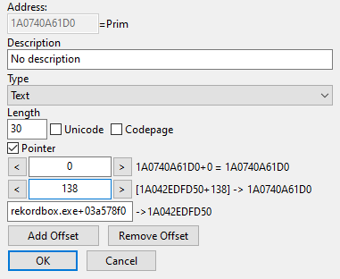
9. Increase the offset by 0x30 from its initial value, and verify the song title in deck 2 appears. If it does not, discard the pointer and try the next one starting at step 7. 
10. Repeat step 9 cycling through all 4 decks, so the deck 4 title offset value will be 0x90 above the initial offset value.  
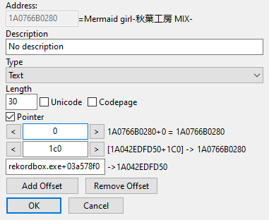
11. Congratulations, you have a pointer that should work for all deck modes. Maybe.

### Finding the Deck Struct via bpm
What we are looking for is an array of Deck structs. The Deck struct looks something along the lines of {Title, Artist, Album, ?, BPM, Key} Same with the HARD MODE above.

1. Start rekordbox in 2-deck mode. Switch over to 4-deck.
2. Load songs in all 4 decks. Preferably something you'd like to listen to while scanning for pointers.
3. Change the tempo of deck 1, then do a text/string search for the track's original BPM (so 155.00 in the pic below, not 159.10) You should get a couple results like 
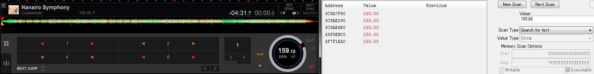 
4. Grab all those addresses into the bottom window and right click, perform a Pointer scan for that address. Make sure to keep organized. I'd like to name the scan files as their respective row. ie. the 3rd row will just be named 3. And the rescans in the upcoming steps will be named 3-1. It's important to keep the previous scans in the case you do an error and need to recover.
5. After all the scans are done, and you have all of the scan windows open. Change the song of Deck 1 to a different song.
6. After changing the song, you should see that some of the addresses have changed. Those are the pointers you want. 
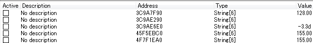 
In the above case, I'll be taking a look at the 2nd and 3rd address.
7. There will be exactly one pointer which is correct (at least in rekobo v5.8.5) so switch deck 1 to a new track. Do a search for the new track's BPM, add it to the codelist (doubleclick the result), rightclick » change record » type: `4 bytes`, rightclick » disable "Show as hexadecimal" and that integer value is what we want in the pointerscan results. So in the ptrscan window click on Pointer Scanner -> Rescan Memory, Hit value to find. I switched mine to to a 120.00 bpm song so my 4 byte value is 774910513. 
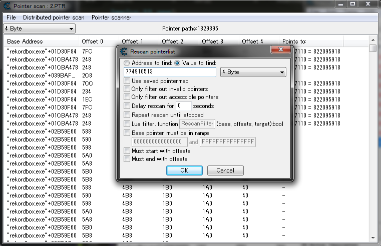
8. After getting the pointer you want to test onto the main window by double clicking, double click on address, and change the second to last pointer (538 in the pic below) by hitting the left and right arrows or by adding/subtracting 8 bytes. When moving by 8 bytes, you'll be traversing the struct mentioned above. If you hit it 4 times (jumping 32 bytes), you should end up in the title for deck 1. 
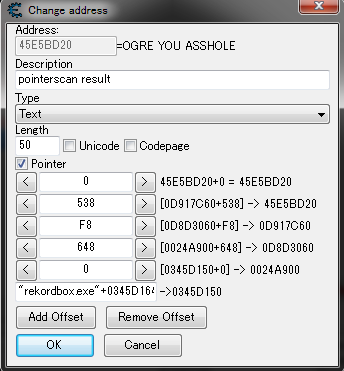
9. If you have confirmed that the pointer you found was a deck struct and is working, here comes the fun part. If you keep adding 8 bytes to the second to last offset, you should end up in deck 2. And if you continue adding, you'll end up in deck 3, and then deck 4. Note that the pointer should also work if there's nothing loaded into deck 1, so eject the first track and see if you can still traverse to the other decks. If the pointer you found does not lead to the other decks, Head back to step 7 and grab yourself another one, or you can repeat the same procedure for other decks and find different pointers for each (not recommended tho).
10. If you have found a pointer that can be used to get all the other decks too, it's time to test it. It should be able to withstand: Closing and reopening rekordbox,  switching modes to export/performance/lighting. What it should not be able to withstand: Updating rekordbox.
11. See step 11 of HARD MODE.

## Master Deck
Finding a master deck pointer is easy as there are usually plenty of valid pointers for it. The master deck value is an integer with the deck indexes being 0-based. So deck 1 is set as master, the pointer will show 0, with deck 2 set it would show 1, etc.

1. You can change deck modes and the pointer found should still work, so to make things easier set Rekordbox to 4-deck mode
2. Set one of the decks in Rekordbox as Master.
3. In CheatEngine, set the Value Type to 4 bytes, enter the expected deck number in the search box, and click First Scan 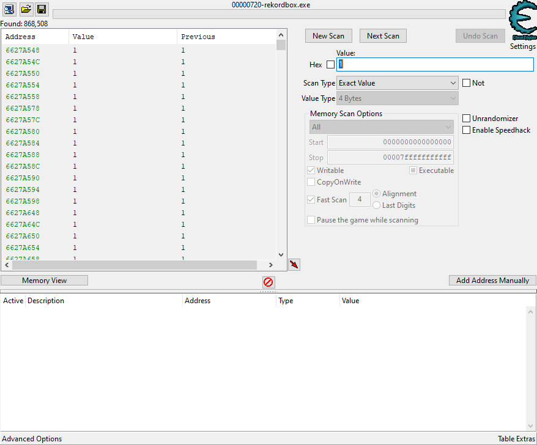
4. Change the master deck in Rekordbox, set the search value to the expected one, and click Next Scan 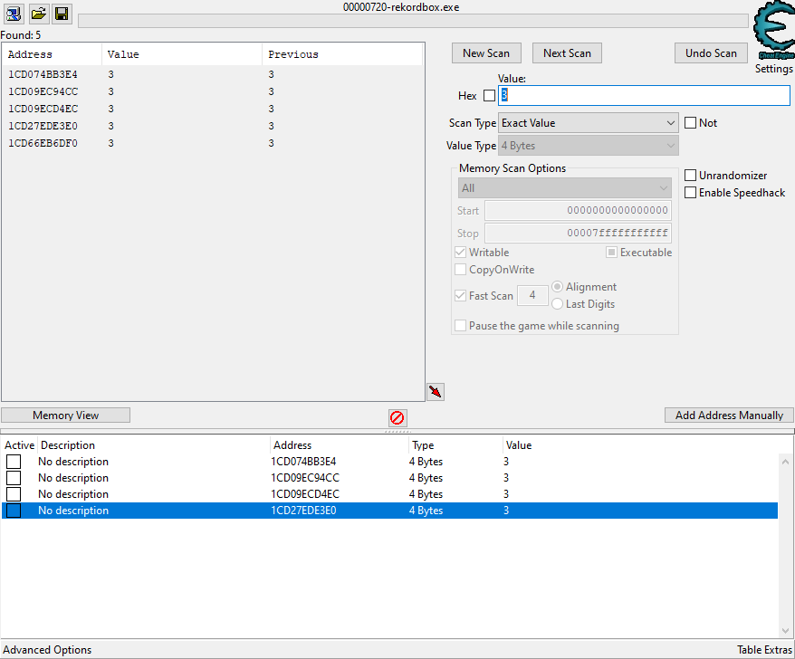
5. Repeat step 4 until you have narrowed the list of address found to a manageable amount.
6. Change the master deck and check the addresses after each change. They should all show  the correct value. Choose one and scan for a pointer per Step 1 of ez mode artist/title instructions.
7. Choose any pointer you want that uses "rekordbox.exe" as part of the base address. You can sort the offset columns to find the pointer with the fewest offsets.