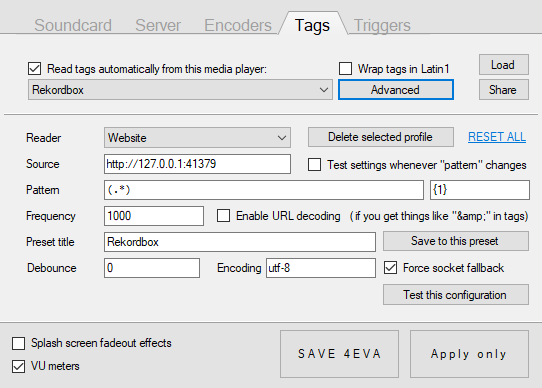
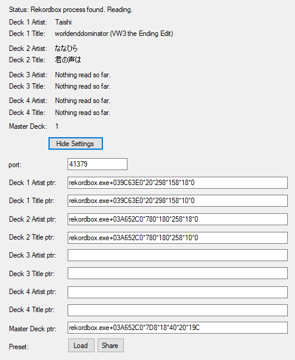

# Rekordbox Reader
Probes the memory of Rekordbox, which is DJ software by PioneerDJ, and retrieves the artist and title metadata of the tracks currently loaded into the decks. A local HTTP daemon is run (default port 41379) that can be sent a GET request to retrieve the metadata of the current master deck. This is mostly meant to be used with [Loopstream](https://github.com/9001/Loopstream) but could have potential elsewhere, maybe.

As this program probes memory, and Rekordbox is 64-bit software, this program must be built in 64-bit mode to work.

This has been tested and working with Rekordbox 5.8.1 and 5.8.3, and settings for both can be found below. Other versions require probing for pointers using CheatEngine.

## Known Issues
* Switching from 2-deck mode to 4-deck mode in Rekordbox breaks things, and requires its own set of pointers.
* Switching from 4-deck mode to 2-deck mode breaks things worse, and using the 2-deck mode pointers won't work until Rekordbox is re-opened.
* This software is garbage (won't fix)

## Loopstream Setup
Open Loopstream's settings and go to the Tags tab. Copy the below and then click "Load" on the Tags settings window. This should import a tag reader that polls Rekordbox Reader.
``##gz#H4sIAAAAAAAEAEWMwQrCMBBEf8WjCrqNCtUy7Ed48dwm2xosaU1SUMR/N1FR9vDmzcAieM3nGMeKSG3KdZFOVTu1LQ+gvGGMjufr5QKUE6KNfJTL4E0z3EBZYSToGTG81EY8n6QJNgro62i9XFkVRQF6R3R+ZAXKQOM0pyEDk++N6MEIt3Uf0od/AXGJ1nU8xXa1B/0cdyu94Yd6gj7xBdyQcd/VAAAA##``

Alternatively, if you are cautious about letting a program deserialize gzipped text data, setup Loopstream tags as below.

## Setting presets
Because we are great coders, the default pointers loaded with Rekordbox Reader might not actually be correct for your setup. Use the below settings for your version by copying the string, clicking "Show Settings" on Rekordbox Reader, and clicking "Load". Alternatively refer to the images below each set of text.

### v5.8.1
* 2-deck mode:
``!RR!H4sIAAAAAAAEADNSVCxKzc4vSknKr9BLrUjVNjC2TDYxMzDQMgIiSwstQ1MgttAyIEqdATZ1iWbGxqYGWuYWBkCDgIpxGohNIdhEGEDX4AjV4AI20QTsFkNLZwDIRR521AAAAA==``

### v5.8.3
* 2-deck mode:
``!RR!H4sIAAAAAAAEADNSVCxKzc4vSknKr9BLrUjVNjC2dDYzdjXQMgIiSwstQ1MgttAyIEqdATZ1jmamRs4GWuYWBkCDgIpxGohNIdhEGMClwQVsognYLYaWzgBC9XCN1AAAAA==``

